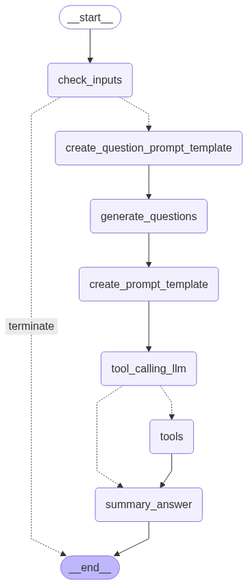

# AgentAI UNSDG

This project creates an application that allows to do Deep Research on the UN SDG goals.
It allows to use a free text of keywords to create a full report with a progress grade.
The application has two use cases:
1) Deep Research (DeepRishSearch)
2). AskSmart UN SDG Assistant.
The 2nd use case mainly generates questions,
but if you use a Gemini API key Gemini Pro 2.5 will answer the questions.

The application requires a Google or OpenAI API key,
and in the Deep Research mode also a key with Tavily Search.

For a detailed deep dive on the algorithm and testing check out this article on Medium:
[Minding the Context Gap in the development of AI Research Agents](https://generativeai.pub/minding-the-context-gap-in-the-development-of-ai-research-agents-78804ea016ce).

# Train DistilBert Model

This is done in the folder ``train_bert`` that has the main code and will store the model in a folder ``topic_classifier_model``. The model makes use of the distilbert_model and related tokenizer loaded from ``transformers``.

## Collect Webpage Training Data

``python PreProcess_TrainingData.py`` pulls down each individual goals page and related topic pages and creates document chunks and labels to train the model.
The code also creates a column with a list of keywords using KeyBert. This is useful for generating the curated file ``Keyword_Patterns.csv`` from the raw data in JSON ``KeywordPayload.json``. This is used to enhance questions via the selected keywords (passed in the prompt). All results from the script are stored in
``training_data``.

## Train and test the model

``python train_classifier.py `` then performs the training loop, produces a confusion matrix, and runs a unit test on an example test to produce a list of probabilities. The model output is stored in a folder called ``topic_classifier_model``. This model is called in the Agent after the initial user prompt to identify probabilistically, which topics the user would like questions for.

# Agent Code: Nodes and Edges
The main applications and functions are defined in the folders:
```
state
llm
graph
streamlitui
```
To test the two cases of functionality, use the ``test_scripts`` folder: ``PreprocessPrompt.py`` (For the question generation) and ``research.py``.

The folder also consists of the diagram for the Agent:



The state folder defines the state vector as a typed dictionary of fields. This state vector is transformed in each individual node, and is used to create the prompt for the Generative AI provider from a prompt template.

The llm folder consists of a simple LLM setup function that loads either:
* Gemini Pro 2.5 using the user specified Gemini Key
* OpenAI gpt-4o-mini using the user specified OpenAI key

You can consider even modifying the LLM setup code with a GROQ API key allowing to select multiple model types e.g. (Qwen, Llamma, Mistral, Phi etc )

## Question Model

## Research Model

# Run in Streamlit Container
To run the repo locally:

```
streamlit run streamlit_app.py
```

For DockerBuild:
```
docker build -t test_unagent .
docker run test_unagent:latest
```
